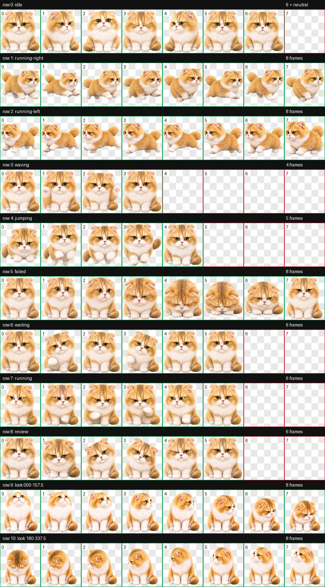

# Smelly Cat Gao

这是我的 Codex 自定义动态宠物：一只金白色长毛猫，绿色大眼睛、粉色鼻子、白色爪子，带一点怀疑一切的小老板表情。



## 仓库内容

- `pet/smelly-cat-gao/`：可直接安装的 Codex v2 宠物包
- `source/reference/`：角色参考图
- `source/prompts/`：生成基础形象、动作行和 16 个观察方向时使用的提示词
- `source/rows/`：最终采用的基础图及动作源图
- `qa/`：最终图集、动作循环和方向语义的校验产物
- `scripts/`：本地安装及基础结构校验工具
- `tests/`：工具的自动化测试

## 安装

需要 Python 3.10+ 和 Pillow：

```bash
python3 -m pip install -r requirements.txt
python3 scripts/verify_pet.py pet/smelly-cat-gao
python3 scripts/install_pet.py pet/smelly-cat-gao --force
```

安装目标默认为 `~/.codex/pets/smelly-cat-gao`。重新打开 Codex 后即可选择该宠物。

## 图集规格

- Codex sprite version：2
- 图集：`1536 × 2288` WebP
- 单格：`192 × 208`
- 布局：8 列 × 11 行
- 动画：9 个标准状态 + 16 个顺时针观察方向

关键确定性校验报告位于 `qa/validation.json` 和 `qa/chroma-despill.json`。方向语义及盲测结果位于 `qa/direction-semantics.json` 和 `qa/direction-blind-validation.json`。

## 测试

```bash
python3 -m unittest discover -s tests -v
```

## 权利说明

本仓库未授予开源许可。角色参考图、生成素材和宠物图集保留全部权利。
